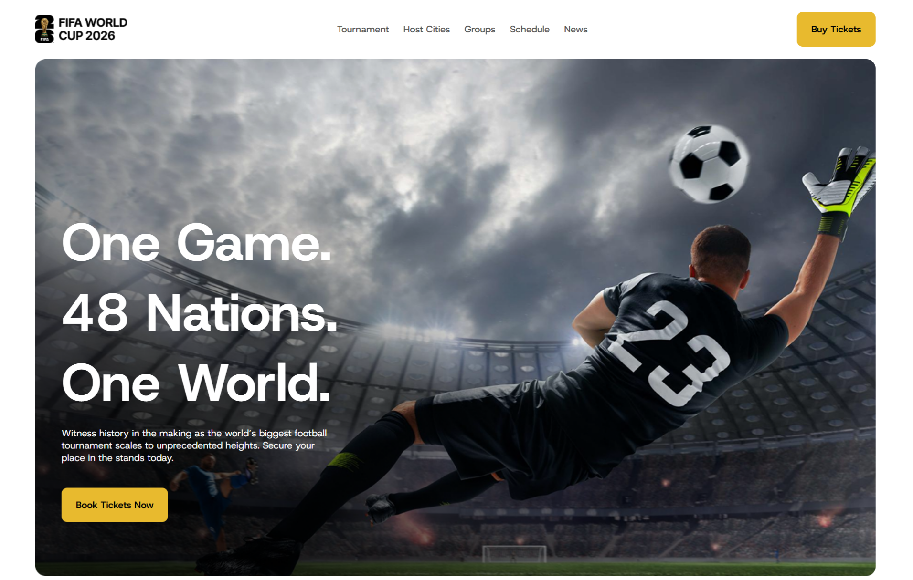
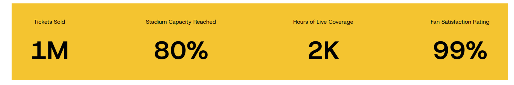
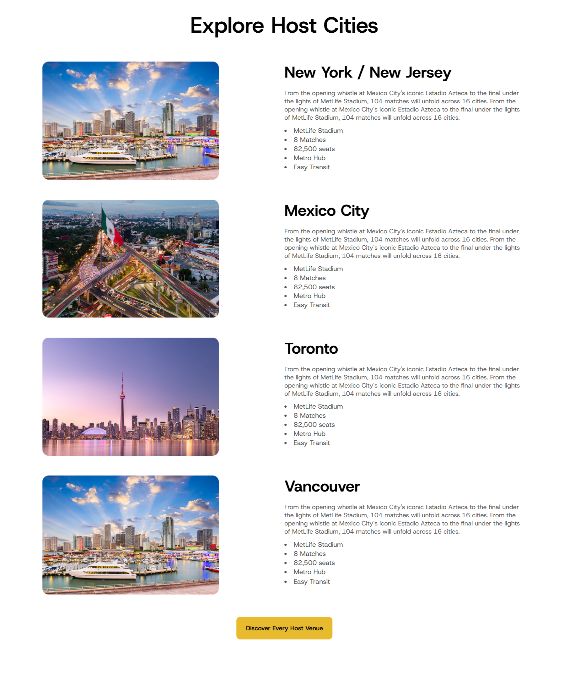
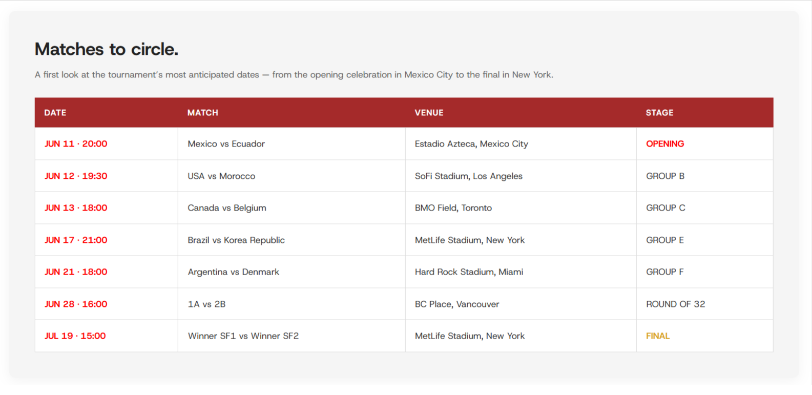
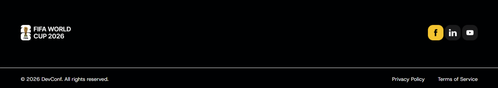

# ⚽ FIFA World Cup 2026 — Tournament Website

**FIFA World Cup 2026** is a modern football tournament website designed to showcase the excitement, venues, matches, and key statistics of the 2026 FIFA World Cup.

The project was built from scratch as part of my web development learning journey, with a focus on practicing **HTML structure, CSS layouts, visual hierarchy, spacing, typography, and modern website design**.

## 🌐 Live Demo

🔗 **Live Website:**  
https://iamsahedrana.github.io/FifaWorldCupWebsite/

🔗 **GitHub Repository:**  
https://github.com/IamSahedRana/FifaWorldCupWebsite

---

# ✨ Features

- FIFA World Cup 2026 themed landing page
- Tournament statistics section
- Host cities showcase
- Stadium and venue information
- Match schedule
- Tournament statistics
- Modern football-inspired UI
- Image-based visual sections
- Clean navigation
- Responsive layout
- Hover effects
- Structured content sections
- Footer with social links

---

# 🛠️ Technologies Used

- HTML5
- CSS3
- Google Fonts
- Flexbox
- CSS Grid
- CSS Positioning
- CSS Background Images

---

# 📸 Project Sections

## 1. Hero Section

The hero section introduces the FIFA World Cup 2026 experience with a strong visual presentation and tournament-focused messaging.

### Key Elements

- FIFA World Cup 2026 branding
- Large headline
- Supporting content
- Call-to-action button
- Tournament imagery
- Modern visual hierarchy

### Preview



---

## 2. Tournament Statistics

The statistics section provides visitors with quick tournament highlights.

### Featured Statistics

- **1M** Tickets Sold
- **80%** Stadium Capacity Reached
- **2K** Hours of Live Coverage
- **99%** Fan Satisfaction Rating

The statistics are presented using large typography and clear visual hierarchy so visitors can understand the information quickly.

### Preview



---

## 3. Host Cities

The **Explore Host Cities** section highlights cities hosting FIFA World Cup matches.

### Featured Cities

- New York / New Jersey
- Mexico City
- Toronto
- Vancouver

Each city card contains information about the host venue and stadium experience.

### Card Information

- Host city
- Stadium
- Number of matches
- Stadium capacity
- Transportation information
- Venue highlights

The section uses a card-based layout to organize the information in a visually engaging way.

### Preview



---

## 4. Matches Section

The **Matches to Circle** section provides an overview of important tournament fixtures.

The match schedule includes:

- Match date
- Kick-off time
- Teams
- Venue
- Tournament stage

### Example Fixtures

| Date | Match | Venue | Stage |
|---|---|---|---|
| Jun 11 · 20:00 | Mexico vs Ecuador | Estadio Azteca | Opening |
| Jun 12 · 19:30 | USA vs Morocco | SoFi Stadium | Group B |
| Jun 13 · 18:00 | Canada vs Belgium | BMO Field | Group C |
| Jun 17 · 21:00 | Brazil vs Korea Republic | MetLife Stadium | Group E |
| Jun 21 · 18:00 | Argentina vs Denmark | Hard Rock Stadium | Group F |
| Jul 19 · 15:00 | Winner SF1 vs Winner SF2 | MetLife Stadium | Final |

The table layout makes the schedule easy to scan and gives the website a structured sports-information experience.

### Preview



---

## 5. Key Tournament Stats

The website also includes a dedicated tournament statistics section.

### Statistics

- **Total Goals:** 128
- **Top Scorer:** Mbappé — 8
- **Clean Sheets:** 24

These statistics add a data-focused element to the website and complement the visual sections.

### Preview


---

## 6. Footer

The footer provides the final navigation and branding area of the website.

### Includes

- Website branding
- Social media links
- Facebook
- LinkedIn
- YouTube
- Privacy Policy
- Terms of Service
- Copyright information

The footer uses a clean layout to provide a professional ending to the page.

### Preview



---

# 🎨 Design Highlights

The website was designed around a modern sports and tournament aesthetic.

- Bold football-inspired visual identity
- Strong typography hierarchy
- Large visual sections
- Card-based information architecture
- Consistent spacing
- Clear content grouping
- High visual contrast
- Modern tournament presentation
- Clean navigation
- Structured information layout

---

# 📚 What I Practiced

While building this project, I practiced and improved my understanding of:

- Semantic HTML
- HTML page structure
- CSS layouts
- Flexbox
- CSS Grid
- CSS positioning
- Cards
- Tables
- Typography
- Spacing
- Margins and padding
- Borders
- Border radius
- Background images
- Image positioning
- Navigation bars
- Footer design
- Visual hierarchy
- Responsive design principles

---

# 📂 Project Structure

```text
FifaWorldCupWebsite/
│
├── index.html
├── README.md
│
└── assets/
    ├── images/
    ├── icons/
    └── other website assets/